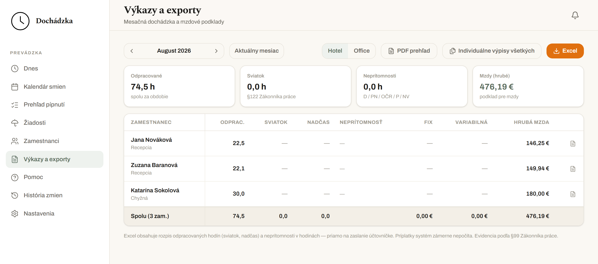
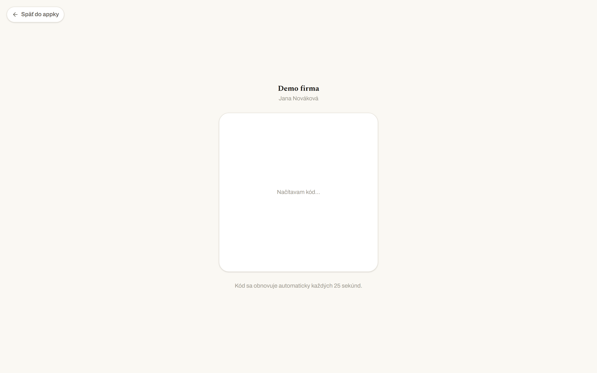
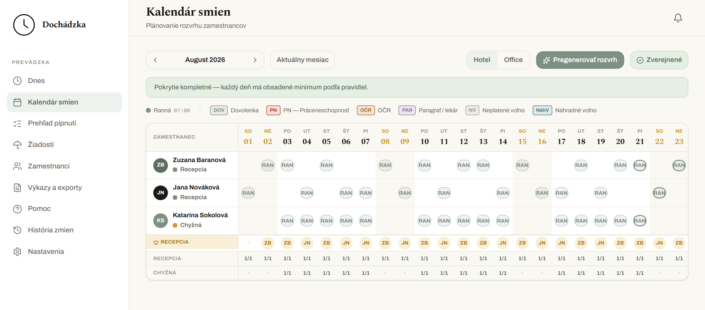
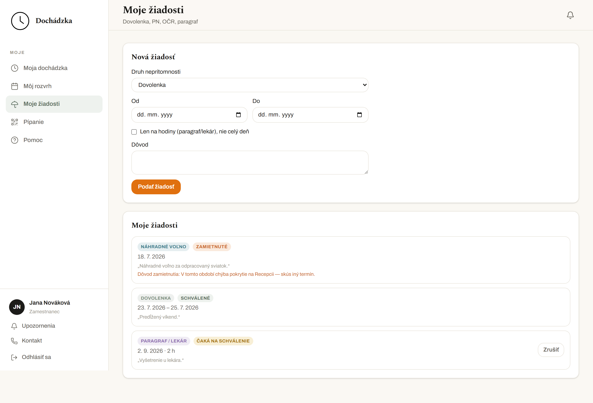
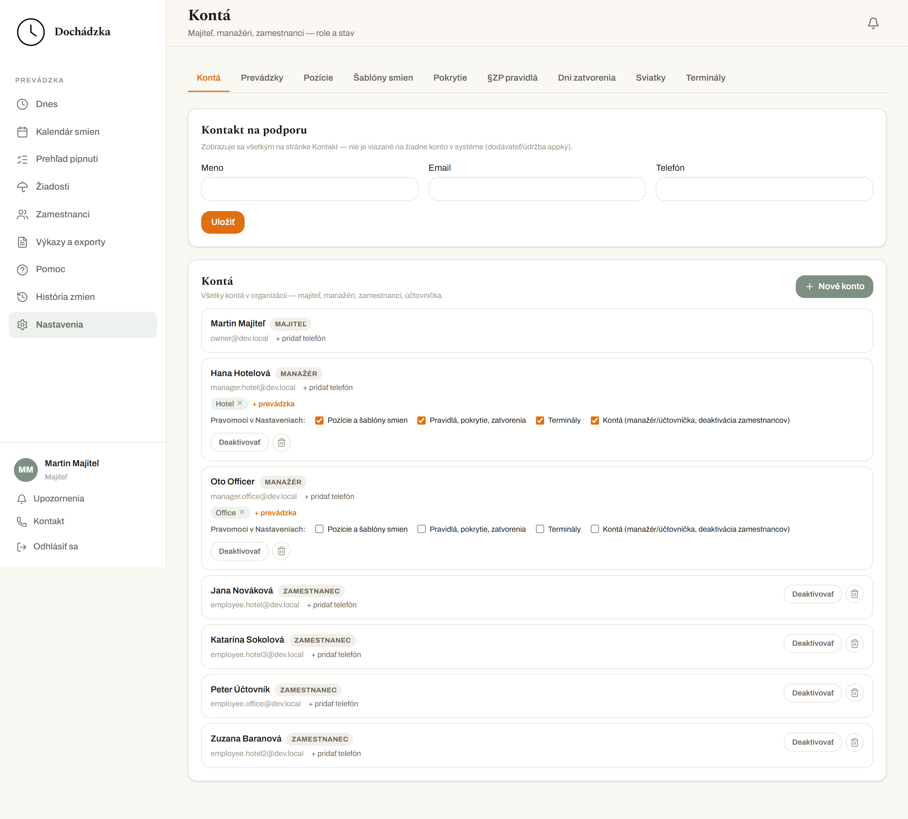
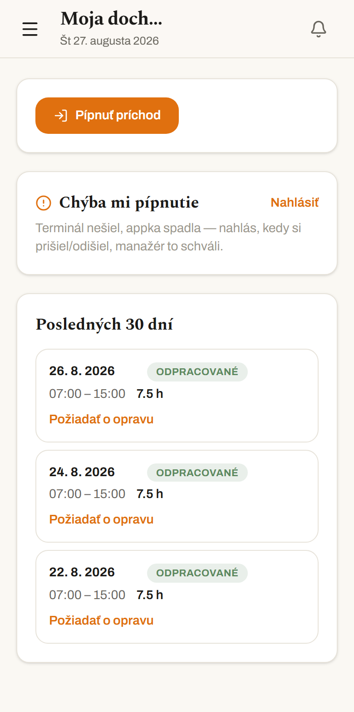

# Dochádzka

Dochádzkový a rozvrhový systém pre firmy s viacerými prevádzkami a zmennou
prevádzkou — QR pípanie, generovanie rozvrhu podľa pravidiel, žiadosti o
neprítomnosť a mesačné výkazy.

## Čo systém robí

- Evidencia príchodov a odchodov cez rotujúci QR terminál alebo web

  

- Automatické generovanie mesačného rozvrhu podľa pravidiel Zákonníka práce
  a dostupnosti zamestnancov

  

- Žiadosti o dovolenku, PN, OČR a ďalšie neprítomnosti so schvaľovaním
  manažérom

  

- Mesačné výkazy s exportom do Excelu a PDF (ukážka hore, hneď pod nadpisom)

- Granulárne pravomoci manažérov (napr. kto vidí mzdy, kto schvaľuje
  žiadosti, kto upravuje rozvrh)

  

- Viac prevádzok s izoláciou dát medzi nimi

*Zamestnanec si pípne a pozrie dochádzku aj z telefónu.*

## Čo systém zámerne nerobí

- **Nepočíta mzdové príplatky** (nočné, víkendové, sviatočné) — tieto hodiny
  eviduje a zobrazuje ako informačné stĺpce, ale ich peňažnú hodnotu
  neprepočítava. Výkaz je podklad pre účtovníčku, nie hotová mzda.
- **Nie je to mzdový systém** ani nie je napojený na štátne registre
  (Sociálna poisťovňa, zdravotné poisťovne a pod.) — dochádzkové dáta z neho
  treba preniesť do systému, ktorý mzdy skutočne spracúva.

## Pre koho

Firmy s viacerými prevádzkami a zmennou prevádzkou, ktoré potrebujú viesť
evidenciu pracovného času podľa § 99 Zákonníka práce. UI je len po
slovensky a pravidlá generátora sú postavené na slovenskom Zákonníku práce
— to je zámerné zameranie, nie dočasný nedostatok.

## Stack

- **Next.js 15** (App Router, TypeScript) — frontend aj API
- **PostgreSQL / Supabase** — dáta, autentifikácia
- **Drizzle ORM** — migrácie a parametrizované query
- **Row Level Security (RLS) ako primárna bezpečnostná vrstva** — izolácia
  dát medzi prevádzkami sa vynucuje v databáze, nie len v aplikačnom kóde

## Rýchly štart — skutočné nasadenie

1. `git clone` a `npm install`
2. Založ Supabase projekt, skopíruj `.env.example` do `.env.local` a vyplň
   ho (postup je v `docs/INSTALL.md`)
3. `npm run db:migrate`
4. `node --env-file=.env.local scripts/setup-app-role-password.mjs`
5. `npm run setup` — interaktívne založí organizáciu, prvú prevádzku a
   majiteľa
6. `npm run build && npm run start`
7. Prihlás sa ako majiteľ na `<NEXT_PUBLIC_APP_URL>/prihlasenie`

Podrobný návod vrátane tajomstiev, cron úloh a nasadenia je v
[`docs/INSTALL.md`](docs/INSTALL.md). Prispôsobenie loga, názvu a farieb je
v [`BRANDING.md`](BRANDING.md).

**Chceš si appku len vyskúšať alebo na nej vyvíjať?** Netreba zakladať
vlastný Supabase projekt — `npm run dev:bootstrap` rozbehne appku s demo
dátami lokálne cez Docker, jedným príkazom. Návod je v
[`docs/DEVELOPMENT.md`](docs/DEVELOPMENT.md).

## Bezpečnosť

Izolácia dát medzi prevádzkami a organizáciami je vynútená v databáze cez
Row Level Security, nie len v aplikačnej logike — chyba v API kóde nevedie k
úniku cudzích dát. Pípnutia príchodov a odchodov sú nemenné (oprava = nový
záznam, nikdy prepis pôvodného) a každá zmena dochádzky aj mzdových údajov
sa zapisuje do audit logu.

## Testy

73 testovacích súborov (`npm run test`). Časť z nich (testy RLS politík,
generátora rozvrhu proti databáze a podobne) vyžaduje živé pripojenie na
Postgres — bez neho zlyhajú s `DATABASE_URL nie je nastavená`, čo je
očakávané mimo nakonfigurovaného prostredia. `npm run dev:bootstrap`
(`docs/DEVELOPMENT.md`) dá bežať aj tejto časti lokálne.

## Licencia

[AGPL-3.0-or-later](LICENSE) — kód môžeš voľne používať a upravovať, ale ak
upravenú verziu sprístupníš iným ľuďom cez sieť (napr. ako SaaS), musíš im
sprístupniť aj zdrojový kód tejto upravenej verzie. Zrozumiteľné (nezáväzné)
zhrnutie, čo to znamená v praxi, je v [`NOTICE`](NOTICE).

## Komerčná podpora

Kód je voľne dostupný a dá sa nasadiť svojpomocne podľa `docs/INSTALL.md`.
Nasadenie na kľúč, dodávka a osadenie terminálov, migrácia dát z iného
systému, zaškolenie a priebežná podpora sú platená služba — kontakt:
`support@martin-pavlik.com`.

Kontakt na dodávateľa systému sa v každej inštalácii dá nastaviť pri
inštalácii (`npm run setup`) a zobrazuje sa prihláseným používateľom appky
na stránke Kontakt.
